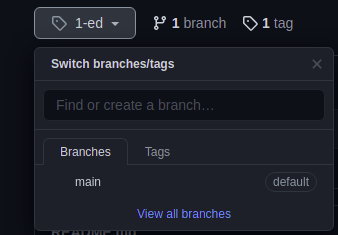

# test-your-skills

    try to solve (at least) one of this problems
    using your favorite programming languages and its frameworks

## Table of the Problems

| ..to be solved |
| --- |
| 1. Find the shortest path between two nodes |
| 2. Find the first 10 prime numbers |
| 3. Sorting 50 numbers. |
| 4. Given two strings, write a program that efficiently finds the longest common subsequence. |
| 5. Given two strings, write a program that outputs the shortest sequence of character insertions and deletions that turn one string into the other. |
| 6. Write a program that displays a bouncing ball. |
| 7. Write a Memory game. |
| 8. Write a program that automatically generates essays for you. |
| 9. Write a program that outputs all possibilities to put `+` or `-` or `nothing` between the numbers `1,2,…,9` (in this order) such that the result is `100`. For example: 1 + 2 + 3 - 4 + 5 + 6 + 78 + 9 = 100. |
| 10. Write a function that combines two lists by alternatingly taking elements. For example: `[a,b,c], [1,2,3] → [a,1,b,2,c,3]`. |
| 11. Write a function that takes a number and returns a list of its digits. So for `2342` it should return `[2,3,4,2]`. |
| 12. Write a function that returns the largest element in a list. |
| 13. Write a function that takes a list of strings and prints them, one per line, in a rectangular frame.

``` txt
For example the list
["Hello", "World", "in", "a", "frame"]
gets printed as:
*********
* Hello *
* World *
* in    *
* a     *
* frame *
*********
```

## How to contribute

- Firstly, `fork` and get your copy of this repo \


- Secondly, create your own `branch` \


- Thirdly, `clone` the repo from your profile on your machine executing the folowing code: \
`$ git clone https://github.com/<your-profile-name>/test-your-skills.git`

- Finally create a `folder-with-your-name` and lets the magic happen 😁🤓..

---

Projects based on: <https://adriann.github.io/programming_problems.html>

&copy; [Nurul Carvalho](mailto:nuruldecarvalho@gmail.com) \
&trade; [ArtesGC](https://artesgc.home.blog)
