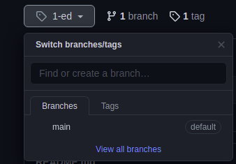

# test-your-skills

Tente resolver esses problemas usando suas linguagens de programação favoritas e suas estruturas

- [Ver Página em Inglês](https://artesgc.github.io/test-your-skills/)

| Problemas a serem resolvidos |
| --- |
| 1. Encontre o caminho mais curto entre dois nós |
|2. Encontre os primeiros 10 números primos |
|3. Classificando 50 números.|
|4. Dadas duas cordas, escreva um programa que encontre eficientemente a mais longa subsequência comum.|
|5. Dadas duas strings, escreva um programa que produza a sequência mais curta de inserções de caracteres e exclusões que giram uma cadeia no outro.|
|6. Escreva um programa que exiba uma bola saltitante.|
|7. Escreva um jogo de memória.|
|8. Escreva um programa que gere automaticamente ensaios para você.|
|9. Escreva um programa que produza todas as possibilidades para colocar `+` ou `-` ou `nada` entre os números `1,2, ..., 9` (nesta ordem) tal que o resultado é `100`.  `Por exemplo: 1 + 2 + 3 - 4 + 5 + 6 + 78 + 9 = 100.` |
|10. Escreva uma função que combine duas listas alternadamente tomando elementos.Por exemplo: `[A, B, C], [1,2,3] → [A, 1, B, 2, C, 3]`.|
|11. Escreva uma função que leve um número e retorne uma lista de seus dígitos. Então, para `2342`, deve retornar `[2,3,4,2]`.|
| 12. Escreva uma função que retorne o maior elemento de uma lista.|
|13. Escreva uma função que leva uma lista de cordas e imprime-as, uma por linha, em um quadro retangular.

``` txt
Por exemplo, a lista
["Olá", "Mundo", "dentro", "um", "quadro"]
é impresso como:
**********
* Olá    *
* Mundo  *
* dentro *
* um     *
* quadro *
**********
```

## Como contribuir

- Em primeiro lugar, `fork` e obtenha sua cópia deste repo \


- Em segundo lugar, crie o seu próprio `branch` \


- Em terceiro lugar, `clone` o repo do seu perfil na sua máquina executando o seguinte código: \
`$ git clone https://github.com/<seu-nome-do-perfil>/test-your-skills.git`

- Finalmente crie uma `pasta-com-seu-nome` e deixa a mágica acontecer 😁🤓..

---

Projeto baseado em: <https://adriann.github.io/programming_problems.html> *(documentacao-em-ingles)*

&copy; [Nurul Carvalho](mailto:nuruldecarvalho@gmail.com) \
&trade; [ArtesGC](https://artesgc.home.blog)
